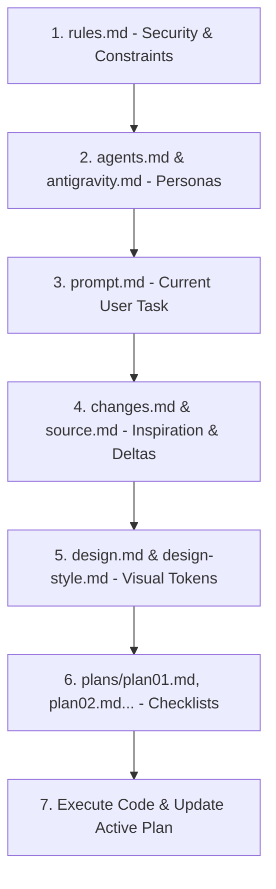

# Project Tiramisu — Master Framework Guide (`howto.md`)

> **Creator**: Harshit (wl2sa) — 12-Year-Old Architect from India 🇮🇳  
> **Framework**: Project Tiramisu

---

## ✅ What this file DOES
1. **Instructs the AI Agent**: Acts as the master entry point and operating manual for any AI model working in the project.
2. **Defines Order of Operations**: Specifies the exact sequential reading lifecycle the AI must follow to avoid context rot and hallucinations.
3. **Explains Multi-Plan Execution**: Directs the AI to look inside the `plans/` directory (where multiple plans live, such as `plan01.md`, `plan02.md`, etc.) to track progress.
4. **Enforces Layer Separation**: Reminds the AI to respect the distinct boundaries of every layer in Project Tiramisu.

---

## 🛑 What this file DOES NOT do
1. **Does NOT hold active user tasks**: Never put your immediate feature requests or bug reports here (put those in `prompt.md`).
2. **Does NOT contain code implementations**: Do not write application source code or components inside this file.
3. **Does NOT contain permanent constraints**: Security rules and dos/don'ts belong strictly in `rules.md`.

---

## 💡 Practical Real-World Example

### The AI Reading Sequence


### Example AI Initialization Prompt:
```markdown
"Hello! I am operating under Project Tiramisu by Harshit (wl2sa).
I have read rules.md (no secrets, clean code).
I have read prompt.md (target goal).
I will follow design.md for styling and update plans/plan01.md as tasks finish."
```
